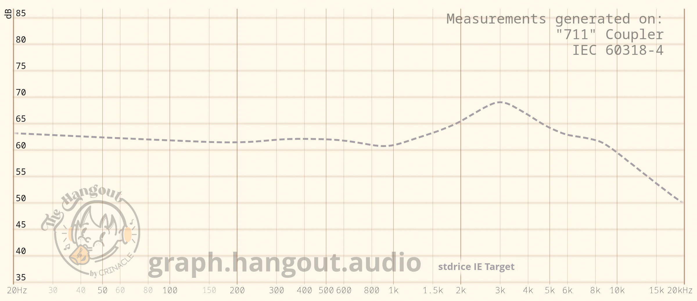
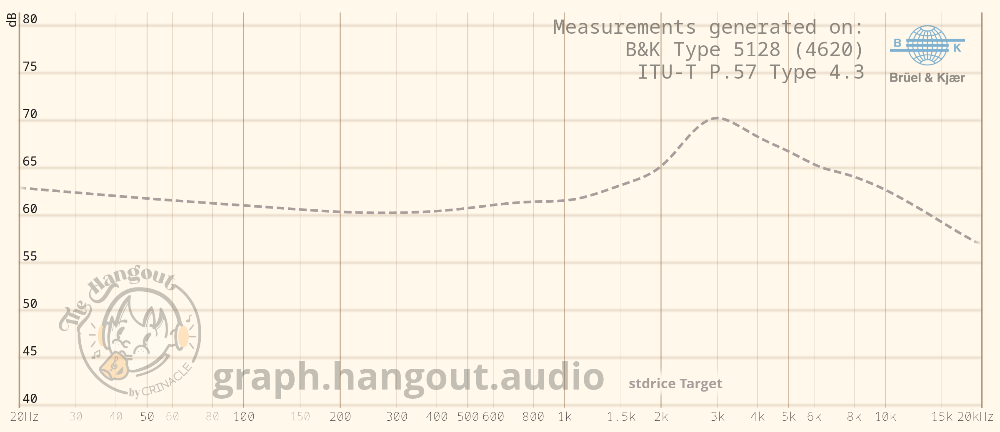

# Audio stuffs

# [stdrice IE Target](stdrice%20IE%20Target.txt) / [IEF](stdrice%20IEF%20Target.txt)
- IE target.
- For IEC-711/60318-4/Type 3.x.
- IEF version for Crinacle(-compatible) couplers.

# [stdrice Target](stdrice%20Target.txt)
- IE/AE/OE target
- For B&K 5128 (IE/AE/OE), IEC-711 (AE/OE)

# Notes
- These are neutral targets (flat to my ears). Bass and treble are optional.
- Intended for tonality/tuning comparison, not loudness matching.
- IEMs are normalized at 1000 Hz, headphones at 900 Hz.
- Personal reference, but can be used as a standard.
