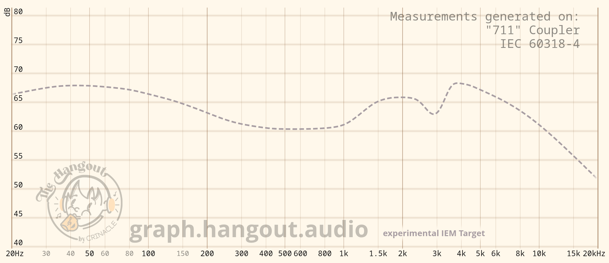
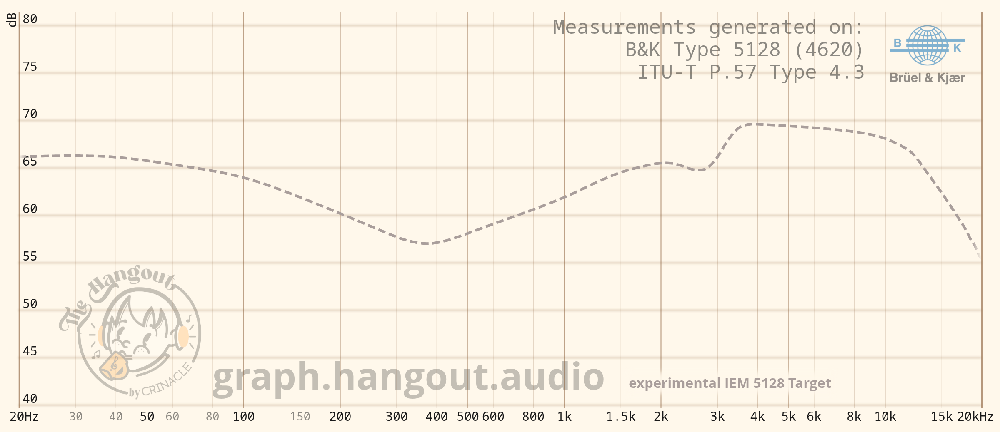

# Audio stuffs

# [stdrice Target](stdrice%20Target.txt)
- IE/AE/OE target
- For B&K 5128 (IE/AE/OE), IEC-711 (AE/OE)

# [stdrice IE Target](stdrice%20IE%20Target.txt)
- IE target.
- For IEC-711/60318-4/Type 3.x.

# [experimental IEM Target](experimental%20IEM%20Target.txt)
- This is what I consider to be the perfect sound for IEMs.
- Based on many flagship IEMs

# [experimental IEM 5128 Target](experimental%20IEM%205128%20Target.txt)
- Same as above but for 5128

# Notes
- These are neutral targets (natural or flat to my ears). Bass and treble are optional.
- Personal reference, but can be used as a standard.
