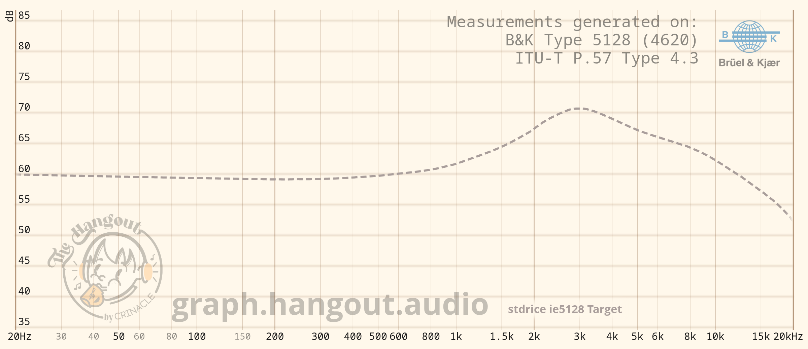
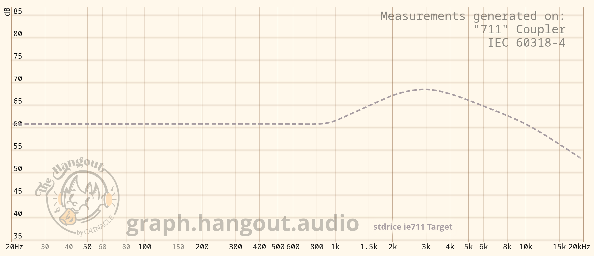
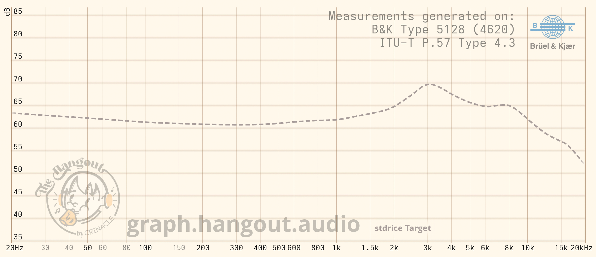
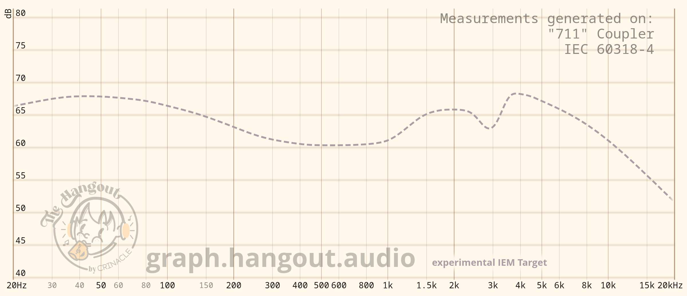
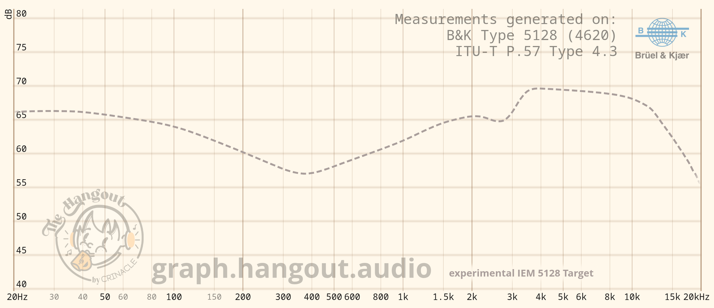

# Audio stuffs

# [stdrice ie5128](stdrice%20ie5128%20Target.txt)
- IE target.
- For B&K 5128/Type 4.x.

# [stdrice ie711](stdrice%20ie711%20Target.txt)
- IE target.
- For IEC-711/60318-4/Type 3.x.

# [stdrice headphones](stdrice%20headphones%20Target.txt)
- Headphones target.
- For GRAS 45CA/IEC 60318-4/Type 3.x.

# [experimental IEM Target](experimental%20IEM%20Target.txt)
- This is what I consider to be the perfect sound for IEMs.
- Based on many flagship IEMs

# [experimental IEM 5128 Target](experimental%20IEM%205128%20Target.txt)
- Same as above but for 5128

