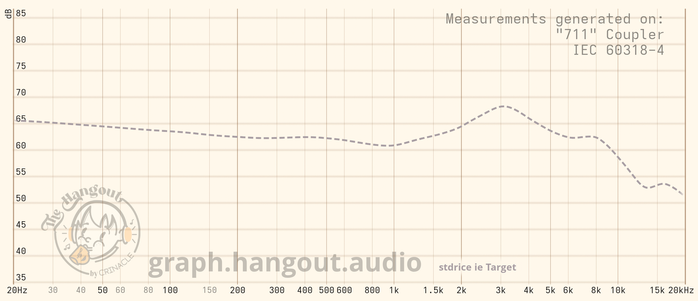

# Audio stuffs

# [stdrice Target](stdrice%20Target.txt)
- IE/AE/OE target.
- For B&K 5128/Type 4.x (IE/AE/OE), IEC60318-4 (AE/OE).

# [stdrice ie Target](stdrice%20ie%20Target.txt)
- IE target.
- For IEC-711/60318-4/Type 3.x.

# Notes
- These targets are neutral target, not preference target.
- Bass is optional, however, i'd prefer 80Hz Q 0.71 Low shelf for 5128 and 105Hz Q0.71 Low shelf for 711.
